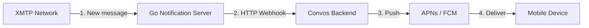
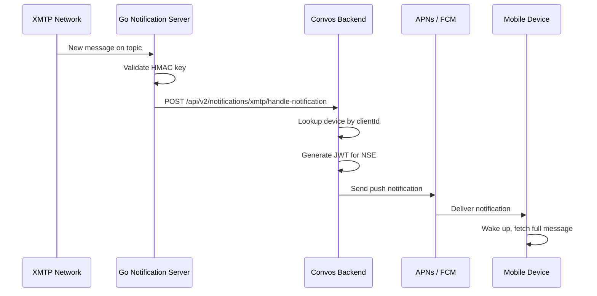

# Push Notification System

## Overview

## Webhook Sequence

## Why Use the Go Notification Server?

The Go server (`xmtp/notifications-server`) is part of XMTP infrastructure. It listens directly to the XMTP network for new messages - something our TypeScript backend cannot do.

| Go Server | Convos Backend |
|-----------|----------------|
| Listens to XMTP network (gRPC) | Receives HTTP webhooks |
| Validates HMAC keys | Sends push notifications |
| Detects new messages on subscribed topics | Manages device registrations |
| Part of XMTP infrastructure | Our custom code |
